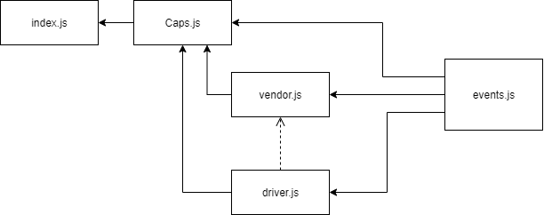

# LAB - Class 16: Event Driven Applications

## Project: CAPS

### Author: Dina Alsaid

### Links and Resources

- [ci/cd](https://github.com/dinaAlsaid/CAPS/actions)

### Setup

#### `.env` requirements

- `STORE` - blackMarket

#### How to initialize/run your application

- `npm start`

#### How to use your library

#### Tests

- No tests yet, didn't understand exactly what the test requirement is.

#### UML

##### class 16

